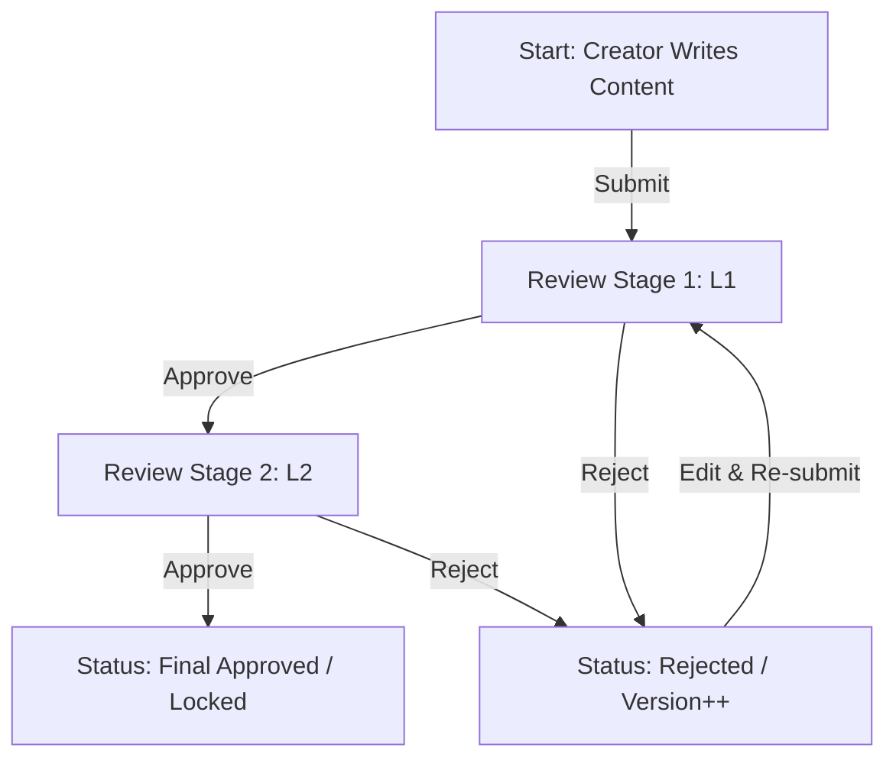

# ContentFlow - Content Review & AI Generation System

A full-stack application for managing content creation, multi-stage approval workflows, and AI-powered content generation.

## 🚀 Overview

ContentFlow provides a streamlined process for content creators to draft articles, use AI to assist in writing, and submit them through a rigorous multi-stage review process (L1 & L2).

---


## 📊 Workflow Diagram (Mermaid)



---

## 🛠️ Installation Guide

### Prerequisites
- **Node.js** (v18 or higher)
- **MySQL** Database
- **Groq API Key** (for AI generation)


## 📦 Setup & Development

1. **Clone & Install**:
   ```bash
   # In frontend and backend directories
   npm install
   ```

2. **Environment Configuration**:
```bash
   # Create a .env file
   # Add:
   # PORT=5000
   # DB_HOST=localhost
   # DB_USER=root
   # DB_PASSWORD=your_password
   # DB_NAME=content_flow
   # JWT_SECRET=your_jwt_secret
   # GROQ_API_KEY=your_groq_api_key
```

3. **Run Locally**:
   ```bash
   # Start Backend
   cd content-flow-backend && npm run dev
   ```

---

## 🔌 API Documentation

### **Authentication**
| Method | Endpoint | Description |
| :--- | :--- | :--- |
| `POST` | `/api/auth/login` | Authenticate user and receive JWT |

### **Content Management**
| Method | Endpoint | Role | Description |
| :--- | :--- | :--- | :--- |
| `POST` | `/api/content` | Creator/Admin | Create new draft content |
| `GET` | `/api/content` | All Auth | List all content items |
| `GET` | `/api/content/:id` | All Auth | Get detailed content by ID |
| `PUT` | `/api/content/:id` | Creator/Admin | Update content (only if Draft/Rejected) |
| `POST` | `/api/content/:id/submit` | Creator/Admin | Submit content to the review pipeline |

### **Review Workflow**
| Method | Endpoint | Role | Description |
| :--- | :--- | :--- | :--- |
| `POST` | `/api/review/:id/approve` | Reviewer L1/L2 | Approve content to the next stage |
| `POST` | `/api/review/:id/reject` | Reviewer L1/L2 | Reject content back to creator |
| `GET` | `/api/review/:id/history` | All Auth | View full audit trail of approvals/rejections |

### **Sub-Content (Assets)**
| Method | Endpoint | Description |
| :--- | :--- | :--- |
| `POST` | `/api/sub-content` | Add associated assets (links/notes) to content |
| `GET` | `/api/sub-content/:parentId` | Retrieve all assets for a specific content |

### **AI Features**
| Method | Endpoint | Description |
| :--- | :--- | :--- |
| `POST` | `/api/ai/generate-stream` | Stream AI-generated content based on a topic |

---

## 🛡️ Role-Based Access Control (RBAC)

- **Creator**: Can create, edit, view, and submit their own content.
- **Reviewer L1**: Responsible for the first level of technical/quality review.
- **Reviewer L2**: Final authority; approval moves content to "Approved" state.
- **Admin**: Full oversight, can perform all Creator actions and view all data.

---