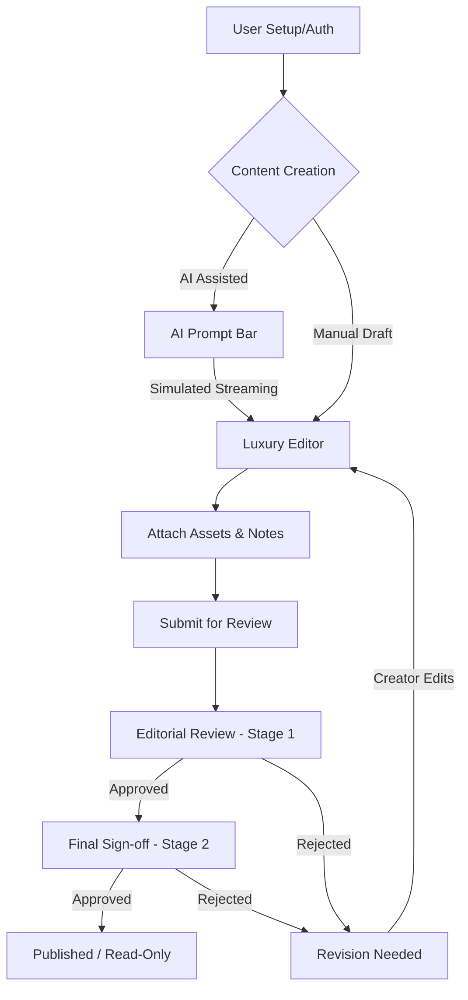

# ContentFlow - Content Review & AI Generation System

A full-stack application for managing content creation, multi-stage approval workflows, and AI-powered content generation.

## 🚀 Content Lifecycle & Workflow

The system follows a deterministic workflow to ensure quality and accountability at every stage of content production.



## ✨ Key Features

### 💎 Premium User Interface
- **Luxury Aesthetics**: A curated palette of Deep Midnight and HSL-tailored accents.
- **Glassmorphic Components**: Layered interfaces with backdrop blurs for visual depth.
- **Micro-animations**: Fluid transitions and interactive feedback for a premium feel.
- **Role-Based Adaptation**: The UI dynamically adjusts based on user permissions (Creator, Reviewer, Manager, Admin).

### 🤖 AI Content Assistant (Advanced Feature)
The platform features a deeply integrated AI writing assistant that transforms simple topics into complete articles.
- **Smart Prompt Bar**: A llama-3 inspired interactive input bar with context-aware controls.
- **Typing Animation**: A sophisticated simulated streaming effect that "types" the AI response char-by-char for a high-end experience.
- **Context-Aware Completion**: Powered by Llama-3 (via Groq SDK), ensuring professional tone and consistent conclusions.
- **Auto-Titling**: The system intelligently generates relevant titles based on your AI prompt.

### 🔄 Multi-Stage Approval Engine
- **Sequential Guardrails**: Content must pass through multiple professional tiers (Reviewer 1 -> Reviewer 2).
- **Restart Mechanism**: Any rejection after an edit forces the workflow to restart from Stage 1, maintaining strict quality control.
- **Audit Logging**: Comprehensive activity trail for all status changes.

### 📂 Asset Management
- **Integrated Workspace**: Directly attach external links and internal notes to content items.
- **Interactive Asset Sidebar**: Manage research material and references without leaving the editor.

## 🛠️ Technology Stack

- **Frontend**: React (Vite), Lucide Icons, Vanilla CSS (Premium Tailored).
- **Backend**: Node.js, Express, Groq SDK (AI Integration), SQL/Database layer.
- **Security**: JWT Authentication with protected routing and role-based access control.

## 📦 Setup & Development

1. **Clone & Install**:
   ```bash
   # In frontend and backend directories
   npm install
   ```

3. **Run Locally**:
   ```bash
   # Start Frontend
   cd content-review-frontend && npm run dev
   ```
